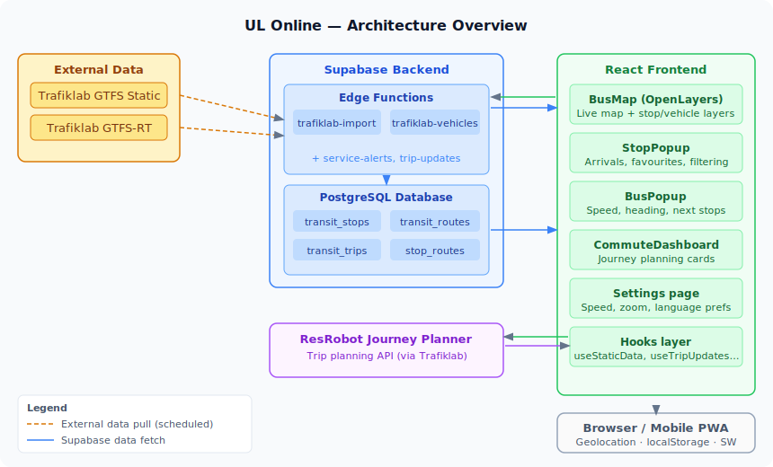

# Architecture

This page gives an overview of how UL Online fits together. If you've just cloned the repo and want to get it running, start with [Configuration](Configuration) and [Development Guide](Development-Guide) instead.

---

## System diagram



The diagram above shows the three main areas: external data sources on the left, the Supabase backend in the middle, and the React frontend on the right.

---

## External data sources

All transit data comes from [Trafiklab](https://www.trafiklab.se/), Sweden's open transit data platform:

| Source | What it provides | How it's used |
|--------|-----------------|---------------|
| **GTFS Static** (Sverige 3) | Stops, routes, trips, stop-times | Imported once (or periodically) by the `trafiklab-import` Edge Function into the Supabase database |
| **GTFS-RT** (Sverige 3) | Live vehicle positions, trip updates | Fetched on demand by `trafiklab-vehicles` and related Edge Functions, then forwarded to the frontend |
| **ResRobot** | Journey planning | Called directly by the frontend via `fetchResRobotTrip` for the commute dashboard |
| **Trafikverket Open Data** | Road situations / disruptions | Fetched by an Edge Function for the service alerts feature |

None of the real-time API keys are embedded in the frontend. They live as Supabase Edge Function secrets and never leave the server.

---

## Supabase backend

Supabase provides two things here:

### PostgreSQL database

The static GTFS import writes four core tables:

- `transit_stops` — every stop with its coordinates and name
- `transit_routes` — route definitions (line numbers, long names)
- `transit_trips` — individual trips linking a route to a schedule
- `stop_routes` — a denormalised join table for fast stop→routes lookups

See [Data Model](Data-Model) for the full schema.

### Edge Functions (Deno / TypeScript)

| Function | Purpose |
|----------|---------|
| `trafiklab-import` | Downloads the latest GTFS static feed and upserts rows into the database. Run this when you set up, or whenever the schedule changes. |
| `trafiklab-vehicles` | Proxies the GTFS-RT VehiclePositions feed to the frontend, keeping the API key server-side. |

Additional functions handle service alerts and trip updates. The frontend never calls the external APIs directly.

---

## React frontend

The frontend is a single-page React application built with Vite. All routing is client-side (React Router).

### Key components

```
src/
├── components/
│   ├── BusMap.tsx          ← OpenLayers map, vehicle & stop layers
│   ├── BusPopup.tsx        ← Popup for a selected vehicle
│   ├── StopPopup.tsx       ← Popup for a selected stop (arrivals, favourites)
│   ├── CommuteDashboard.tsx ← Journey planning cards (bottom sheet)
│   ├── BottomSheet.tsx     ← Draggable bottom sheet (mobile)
│   ├── InstallBanner.tsx   ← "Add to home screen" prompt for iOS
│   └── RefreshTimer.tsx    ← Countdown to next data refresh
├── hooks/
│   ├── useStaticData.ts    ← Loads stops/routes from Supabase, caches to localStorage
│   ├── useTripUpdates.ts   ← Polls for GTFS-RT trip delays
│   ├── useServiceAlerts.ts ← Fetches active service alerts (60s interval)
│   ├── useRoadSituations.ts ← Trafikverket disruption data
│   ├── useCommutePlans.ts  ← ResRobot journey planning logic
│   ├── useFavoriteStops.ts ← localStorage-backed favourite stop list
│   └── useSavedPlaces.ts   ← localStorage-backed saved places (Home/Work/School)
├── lib/
│   ├── api.ts              ← Supabase + Edge Function calls
│   ├── busIcon.ts          ← Canvas rendering for directional bus icons
│   ├── stopGroups.ts       ← Clusters nearby stops into logical groups
│   ├── transitMatching.ts  ← Haversine distance, best stop matching
│   ├── tripSchedules.ts    ← GTFS schedule parsing and ETA estimation
│   ├── preferences.ts      ← User preferences (localStorage)
│   ├── i18n.ts             ← British English / Swedish string definitions
│   └── savedPlaces.ts      ← Saved place types and helpers
└── pages/
    ├── Index.tsx           ← Main map page
    └── Settings.tsx        ← Settings page
```

### Data flow at runtime

1. **App load** — `useStaticData` fetches stops and routes from Supabase, storing them in `localStorage` after the first successful response. Subsequent loads use the cache and check for updates in the background.

2. **Live vehicles** — `BusMap` polls the `trafiklab-vehicles` Edge Function every ~15 seconds while the browser tab is visible. Each vehicle is rendered as a directional arrow icon on the OpenLayers map.

3. **Stop selection** — Tapping a stop opens `StopPopup`, which calls `fetchStopTimesMulti` and matches incoming vehicle positions against the stop's upcoming schedule to calculate live ETAs.

4. **Vehicle selection** — Tapping a bus opens `BusPopup`, which fetches the full stop-time list for the current trip and overlays it on the map as a route highlight.

5. **Commute planning** — When a saved place is active, `useCommutePlans` calls the ResRobot API for journey options, then correlates the suggested trips with the live vehicle feed to produce real-time departure cards.

---

## Map rendering

The map layer uses `ol-mapbox-style` to apply a Mapbox-style JSON stylesheet to an OpenLayers tile layer. On top of that, two `VectorLayer`s sit:

- **Stop layer** — rendered with a `ClusterSource` (distance 34px) so nearby stops merge at low zoom. Splitting the cluster on zoom-in is handled by `getClusterSplitZoom`.
- **Vehicle layer** — each bus is drawn using a `Canvas`-based icon (`busIcon.ts`) that rotates to the vehicle's bearing. Vehicles are bucketed into 15-degree heading increments to avoid regenerating icons on every GPS wiggle.

---

## Language support

The app ships with full British English and Swedish UIs. String definitions live in `src/lib/i18n.ts`. The language is stored in `localStorage` as a preference and can be changed at any time in Settings without a page reload.

---

## Progressive Web App

The app registers a service worker (`public/sw.js`) and ships a `manifest.json`, making it installable on iOS and Android home screens. An in-app install banner nudges iOS users who haven't installed it yet.
