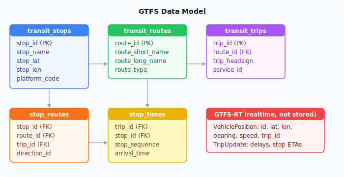

# Data Model

This page describes the database schema and how the different kinds of transit data fit together.

---

## Overview diagram



---

## Static GTFS tables

These tables are populated by the `trafiklab-import` Edge Function and change infrequently (when UL publishes a new schedule, typically once or twice a year).

### `transit_stops`

One row per physical stop location.

| Column | Type | Notes |
|--------|------|-------|
| `stop_id` | text (PK) | GTFS stop ID |
| `stop_name` | text | Human-readable stop name |
| `stop_lat` | float | WGS 84 latitude |
| `stop_lon` | float | WGS 84 longitude |
| `platform_code` | text (nullable) | Platform letter or number, where present |

Stops can share a name but have different `stop_id` values — this is common at larger intersections where there are separate platform positions for different directions. The `stopGroups.ts` utility in the frontend clusters nearby stops under a common name for display purposes.

### `transit_routes`

One row per bus line.

| Column | Type | Notes |
|--------|------|-------|
| `route_id` | text (PK) | GTFS route ID |
| `route_short_name` | text | Line number (e.g. "1", "4X") |
| `route_long_name` | text (nullable) | Full route name |
| `route_type` | integer | GTFS route type code (3 = bus) |

### `transit_trips`

One row per scheduled trip (a single run of a vehicle on a given route).

| Column | Type | Notes |
|--------|------|-------|
| `trip_id` | text (PK) | GTFS trip ID |
| `route_id` | text (FK → transit_routes) | Parent route |
| `trip_headsign` | text (nullable) | Destination shown on the bus |
| `service_id` | text | Calendar service identifier |
| `direction_id` | integer (nullable) | 0 or 1 — inbound vs outbound |

### `stop_routes`

A denormalised join table for fast stop → route/trip lookups. Rather than joining `stop_times → trips → routes` at query time, this table records which trips call at each stop directly.

| Column | Type | Notes |
|--------|------|-------|
| `stop_id` | text (FK → transit_stops) | |
| `route_id` | text (FK → transit_routes) | |
| `trip_id` | text (FK → transit_trips) | |
| `direction_id` | integer (nullable) | Inherited from the trip |

---

## Stop times

The `stop_times` table (populated during import) holds the scheduled arrival and departure time for each stop on each trip. It is queried by the `fetchStopTimesMulti` and `fetchStopTimes` API calls when a stop or vehicle popup is opened.

| Column | Type | Notes |
|--------|------|-------|
| `trip_id` | text (FK → transit_trips) | |
| `stop_id` | text (FK → transit_stops) | |
| `stop_sequence` | integer | Order within the trip |
| `arrival_time` | text | HH:MM:SS — may exceed 24:00 for post-midnight trips |
| `departure_time` | text | HH:MM:SS |

Note: GTFS allows times past 24:00 (e.g. `25:30:00`) for trips that run past midnight. The `parseGtfsTimeToSeconds` function in `tripSchedules.ts` handles this correctly.

---

## Realtime data (not stored)

Live data is fetched fresh on each request and never written to the database. It comes from the GTFS-RT protocol over Protocol Buffers.

### VehiclePosition (per vehicle)

| Field | Notes |
|-------|-------|
| `id` | Vehicle identifier |
| `trip.trip_id` | Links to `transit_trips` |
| `position.latitude` | Current latitude |
| `position.longitude` | Current longitude |
| `position.bearing` | Heading in degrees (0 = north) |
| `position.speed` | Speed in m/s |

The frontend converts speed to km/h for display and snaps bearing to 15-degree buckets for icon rendering.

### TripUpdate (per trip)

| Field | Notes |
|-------|-------|
| `trip.trip_id` | Links to `transit_trips` |
| `stop_time_update[]` | Per-stop delay information |
| `stop_time_update[].stop_sequence` | Which stop in the trip |
| `stop_time_update[].arrival.delay` | Delay in seconds (positive = late) |

The `useTripUpdates` hook fetches these and the frontend uses them to adjust scheduled ETAs.

---

## Saved data (browser localStorage only)

Some data never touches the server and lives entirely in the user's browser:

| Key | Contents |
|-----|----------|
| `walkSpeed` | User's preferred walking speed (km/h) |
| `bufferMinutes` | Buffer time preference (minutes) |
| `maxWalkDistanceMeters` | Max walk distance (metres) |
| `highAccuracyLocation` | GPS accuracy preference (boolean) |
| `stopVisibilityZoom` | Map zoom level for stop markers |
| `language` | Language preference (`en-GB`, `sv-SE`, `system`) |
| `ul-online-favourites` | JSON array of favourite stop objects |
| `ul-online-saved-places` | JSON array of saved place objects |
| `ul-online-map-view` | Last map centre and zoom |
| `ul-online-static-cache` | Cached stops/routes data + ETag |

None of this is sent to any server. Clearing site data in the browser resets all preferences.

---

## Adding a migration

Supabase migrations are SQL files in `supabase/migrations/`. The filename must start with a timestamp in `YYYYMMDDHHMMSS` format:

```bash
supabase migration new add_my_table
```

This creates a new file like `supabase/migrations/20240115123456_add_my_table.sql`. Write your SQL in there, then apply it:

```bash
supabase db push         # local
supabase db push --linked # linked cloud project
```
