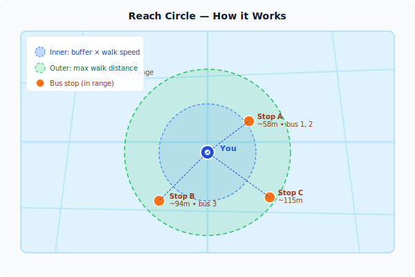

# User Guide

This page covers everything you need to know to get the most out of UL Online as a day-to-day commuter.

---

## Opening the app

Navigate to the app URL in your browser. On your first visit, the browser will ask permission to share your location — click **Allow**. Without your location the map still works, but the reach circles and distance estimates won't appear.

The map opens centred roughly on Uppsala city. If you've used the app before, it restores your last map position.

> **Image needed:** A mobile screenshot showing the browser location permission dialogue overlaid on the map background.

---

## The map

### Bus icons

Each bus on the map is shown as a small arrow icon pointing in its direction of travel. The icon moves in real time — the data refreshes automatically whenever the app tab is visible, roughly every 15 seconds.

> **Image needed:** A zoomed-in map screenshot showing bus arrow icons, ideally with one selected so the popup is visible.

Tap or click a bus icon to open the **bus popup**, which shows:

- Line number and current speed
- Heading (as a compass bearing)
- Distance from your location and estimated walk time to intercept
- The next few upcoming stops on the trip

### Stop markers

Bus stops appear as orange circle markers once you zoom in far enough (the threshold is adjustable in Settings). Tap a stop to open the **stop popup**.

> **Image needed:** A mid-zoom map screenshot showing a cluster of orange stop markers.

The stop popup shows:

- The stop name and any platform groupings (north side, south side, etc.)
- Which bus lines serve this stop
- The next live arrival for each line, with an estimated time in minutes
- A **Filter buses** button that hides all buses except those serving this stop
- A **★ Favourite** button to save the stop to your quick-access list

> **Image needed:** A screenshot of the stop popup panel showing line numbers, ETA chips, and the favourite/filter buttons.

### Reach circles

When your location is active, two concentric circles appear around you:

| Circle | What it means |
|--------|---------------|
| Inner (blue) | Distance you can cover in your **buffer time** at your **walk speed** |
| Outer (green) | Your **maximum walk distance** setting |

Stops within the outer circle are the ones worth considering. The inner circle shows whether you have a comfortable margin.

Adjust the values that drive these circles in [Settings](#settings).

---

## Commute dashboard

If you've saved a **Home**, **Work**, or **School** place in Settings, the app surfaces a commute card at the bottom of the screen when you're near the departure end of a saved commute.

> **Image needed:** A screenshot of the bottom sheet open showing two commute option cards, each with a bus line badge, walk icon, and departure countdown.

Each card shows:

- Which bus line to catch
- The nearest boarding stop and how far it is
- Whether to **leave now**, **leave soon**, or how many minutes you have to spare
- Any service alerts affecting the route

Tap a card to expand it and see the full leg-by-leg journey breakdown.

---

## Filtering by stop

Tap a stop marker, then press **Filter buses** in the stop popup. The map fades out buses that don't serve that stop, making it much easier to track the one you want. A small banner at the top of the screen confirms which stop you're filtering by, with an **× clear** button to reset.

> **Image needed:** A screenshot showing the active stop filter state — faded background buses, highlighted matching buses, and the filter banner.

---

## Service alerts

When there are active service alerts for routes visible on the map, an alert badge appears in the toolbar. Tap it to read the current disruptions.

---

## Settings

Tap the **cog icon** (or navigate to `/settings`) to open the Settings page. Changes take effect when you press **Save and return to map**.

### Journey tab

| Setting | What it does | Default |
|---------|-------------|---------|
| Buffer time | How many minutes ahead you want to intercept a bus | 5 min |
| Walk speed | Your comfortable walking pace | 4 km/h |
| Max walk distance | Stops beyond this distance are not shown in reach | 1000 m |

The buffer time and walk speed together determine the inner reach circle radius.

### Map tab

| Setting | What it does | Default |
|---------|-------------|---------|
| Stop visibility zoom | Zoom level at which stop markers appear | 12 |
| High-accuracy location | Uses GPS rather than network location (uses more battery) | Off |

### App tab

- **Language** — choose British English, Swedish, or follow the system setting
- **Saved places** — add named locations (Home, Work, School, Custom) for the commute dashboard
- **Favourite stops** — view, reorder, or remove stops you've starred

> **Image needed:** A screenshot of the Settings page, Journey tab, showing the buffer time and walk speed sliders with current values.

---

## Installing as a PWA

On **iOS**, a banner appears at the bottom of the screen after a few seconds inviting you to add the app to your home screen via the Share menu. On **Android** and desktop Chrome, your browser may show an install prompt automatically.

Once installed, the app opens without browser chrome and behaves more like a native app.

---

## Offline and caching

Static data (stops, routes) is cached in the browser after the first load. You'll see a brief "Loading cached data / Checking for updates" message on subsequent visits while the app checks whether newer data is available. Live vehicle positions require a network connection.
